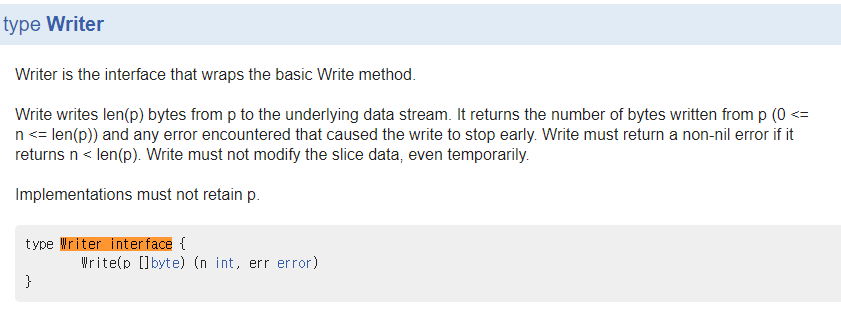

## Interface

* 타 OOP의 interface와 다른점 
> interface에 구현된 내용을 모두 구현하지 않아도 사용이 가능하다.(=묵시적으로 사용 가능하다)

#### Goal!!!
1. 인터페이스 기본 메커니즘
2. 인터페이스를 통한 일반화 방법

#### What is the "interface"? 
* 구상 타입 vs 추상 타입
* 추상 타입 
  * 기본 연산을 드러내지 않고 큰 그림만 가지고 있다. 
    * ex) interface
* 구상 타입
  * 해당 값이 무엇인지, 무엇을 할 수 있는지 볼 수 있다.
    * ex) var, slice, struct....


#### golang 내부에서 사용하는 interface는? 
```go
package fmt

func Fprintf(w io.Writer, format string, args ... interface{} ) (int, error)

func Printf(format string, args ... interface{}) (int, error) {
   return Fprintf(os.Stdout, format, args ..)
}

func Sprintf(format string, args ...interface{}) string {
    var buf bytes.Buffer
    Fprintf(&buf, format, args...)
    return buf.String()
}
```

* 여기에서 Fprintf()에 첫 번째 인자도 io.Writer처럼 interface형이다. 
**Buffer와 os.Stdout 둘다 io.Writer를 interfacing하고 있다.**
* 이와 같이 interface를 통해 일반화를 해서 효율적인 코드를 작성 할 수 있다.
> 이 처럼 인터페이스를 상속(?) 하는 타입을 자유롭게 변경하는것이 대체 가능성(substitutability)라고 한다. 


```go 
package main
import (
	"fmt"
)
type ByteCounter int 
func (c *ByteCounter) Write(p []byte) (int, error) {
	*c += ByteCounter(len(p))
	return len(p), nil
}
func main() {
	var c ByteCounter 
	c.Write([]byte("hello"))
	fmt.Println(c)
	c = 0
	var name ="Dolly"
	fmt.Fprintf(&c, "hello, %s" , name)
	fmt.Println(c)
}

```
> \>5
> \>12

* 이해가 안가서 string도 똑같이 실행되는지 보려고 해봤지만 에러가 발생.

```go
    var str string
    fmt.Fprintf(&str, "hello, %s" , name)
```
> \>Error. 

**미리 정의된 interface**


```go
func Fprintf(w io.Writer, format string, args ... interface{} ) (int, error)
```
* fmt.Fprintf(w io.Writer, ... )함수의 첫 번째 인자가 io.Writer인데 predefine된 Writer(p [] byte) 함수를 구현하였기 때문에 사용 가능.

[example:io.Writer interface](https://play.golang.org/p/Y2PYs-DQMKn)

**아마도 int data type이 io.Writer를 사용 가능 하도록 구현 되어있을 것으로 추측..**

* 연습 문제 꼭 풀어보세요!
[example:](https://play.golang.org/p/WTTtRHcn9JH)

#### 내장 interface
* 인터페이스를 내장하여 새로운 인터페이스를 만들 수 있다.

```go
package io 
type Reader interface {
    Read(p []byte) (n int, err error)
}
type Closer ineterface {
    Close() error
}
//--------------------------------------------
type ReadWriter interface {
    Reader
    Writer
} // .. embedded interface

```
위 코드와 중 ReadWriter interfac와 아래 코드는 같은 결과를 보인다.
```go
type ReadWriter interface {
    Read(p []byte) (n int, err error)
    Write(p []byte) (n int, err error)
}
```
#### 인터페이스 충족 
* 타입 내부에 요구하는 인터페이스가 있으면 이 타입이 인터페이스를 충족한다.
```go
var w io.Writer // io.Writer

w = os.Stdout
w = new(bytes.Buffer)
w = time.Second
```
> Write메소드가 있고 없고에 따라 컴파일 에러가 발생 한다.

##### 함수 선언 시 주의점!
수신자의 데이터 타입(구상 type과 pointer타입)에 따라 instance 생성 후에 사용 할 수 있는 메서드의 종류가 달라진다.
```go 
type IntSet struct {
	TempString string;
}
func (iset IntSet) String() string { // 수신자가 IntSet type 
	return iset.TempString
}
func main() {
	s := IntSet{"initialized text"}
	var ss = s.String()
	fmt.Println(ss)
	
	var _ fmt.Stringer = &s
	var _ fmt.Stringer = s // 컴파일 에러가 발생하지 않음
}
```
```go 

type IntSet struct {
	TempString string;
}
func (iset *IntSet) String() string { // 수신자가 IntSet pointer
	return iset.TempString
}
func main() {
	s := IntSet{"initialized text"}
	var ss = s.String()
	fmt.Println(ss)
	
	var _ fmt.Stringer = &s
    var _ fmt.Stringer = s // 컴파일 에러!!!!!!
                            // IntSet을 수신자로 받는 String()이 없다.
}
```

#### 비어있는 interface  
* 아무거나 담을 수 있다!
  
```go 
var any interface{}
any = true
any = 12.34
any = "hello"
.
.
.
```

> Object(java), void*(c,c++계열)와 비슷한 역할을 한다. 
```go
package src/fmt/print.go

func Printf(format string, a ...interface{}) (n int, err error) {
	return Fprintf(os.Stdout, format, a...)
}
```
이와같은 방식으로 사용한다. 

----
#### flag.Value로 플래그 분석 ???

#### Interface 의 값 
* Interface는 생성 시 type과 value 영역으로 나누어져 초기화 되는데 
	* Type에는 interface의 타입이 들어가고(초기값은 nil)
	* value에는 엮여있는 인스턴스의 포인터값이 들어간다(초기값은 nil)

* Interface는 대부분 서로 비교 할 수 있지만 비교할 수 없는 타입인 경우 panic이 발생한다.
	* e.g slice, ...
```go
var x interface{} = []int{1,2,3}
fmt.Println(x==x) // panic!!!
```

### Golang 의 주요 인터페이스
#### sort interface

* 다른 언어들도 그렇지만 대부분 자주 사용하는 알고리즘들을 라이브러리화 되어있다.
* sort interface의 경우에는 내부 비교를 통해 sorting을 진행하기 때문에 sort.Interface에 정의된 내용을 sorting하려는 struct에 구현해야 사용이 가능하다.
> C++의 비교 연산자 재정의와 연관지어 생각하면 이해가 빠르다. 

**아래 interface를 구현하면 sort를 사용 할 수 있다.**
```go
package sort 
type Interface interface {
	Len() int 
	Less(i, j int) bool
	Swap(i, j int)
}
```
**예시**
```go
type StringSlice []string 

func (p StringSlice) Len() int 
func (p StringSlice) Less(i, j int) bool
func (p StringSlice( Swap(i, j int) 
```

(example)[https://play.golang.org/p/8Onk-2kBrig]

**조건 두개를 순차적으로 적용하여 sort 하고싶다면?**
> 함수의 정의가 추가된 struct를 구현하여 customize된 비교를 할 수 있다.

[https://play.golang.org/p/oE5hmrbLBOh]
```go
type custom struct {
	t []*Track
	less func(x, y *Track) bool
}
```
> 이 처럼 Struct내부에 함수를 정의 할 수 있다. (구현x)
```go
sort.Sort(customSort { tracks , func (x, y *Track) bool{
		if x.Title != y.Title {
			return x.Title < y.Title
		}else if x.Year != y.Year {
			return x.Year < y.Year
		}
			return false
	},
	})
```
> 타 OOP언어에서 사용하는 interface처럼 구현해서 사용 가능하다. 

#### http.Handler interface
* http.Handler는 서버의 기본동작인 dispatcher의 동작을 수행 하도록 구성되어 있으며, 
* **ServeHTTP 함수**를 재정의 하여 dispatcher동작을 수행 할 수 있다. 

```go
type firstWebServer string // interface{} 는 불가능한데 왜일까?
func (firstWebServer) ServeHTTP(w http.ResponseWriter, req *http.Request) {
	fmt.Fprintf(w, "%s", "Hello golang")
	// req.URL.Path를 통해 분기 시켜 작동 시킬 수 있다. 
}
```
[https://play.golang.org/p/G1BzaEopX76]

#### error interface
* 에러를 리턴 할 때 사용하고 간단히 error.New("error msg")로 사용 가능
> 구성 
```go
package error

func New(text string) error { return &errorString{text}}
type errorString struct { text string }
func (e *errorString) Error() string { return e.text }
```
----

#### 표현식 평가하기 
#### 타입 단언(Type Assertion)
* 현재 데이터의 타입을 확인 하여 사용 할 수 있도록 하는 방법
```go
package main
func main() {
	i := 32
	var it interface{}
	it = i // interface[] type.
	v = it.(int)
}
```
```go
func main() {
	if w, ok := weird(7).(int); ok {
		fmt.Printf("w(%s) , ok(%s)\n", w, ok)
		i += w
	}
/////////////////////////////////////////////////////////////////
	
	if w, ok := weird(-22).(int); ok { 
		fmt.Printf("w(%s) , ok(%s)\n", w, ok)
		i += w
	}
/////////////////////////////////////////////////////////////////
	ok2 := true
	if w, ok := weird(-22).(int); ok2 { // 특이한 if문(?)
		fmt.Printf("w(%s) , ok(%s)\n", w, ok)
		i += w
	}
}
func weird(i int) interface{} {
	if i < 0 {
		return "negative"
	}
	return i
}
```
#### Type assertion을 이용한 에러처리
#### Type assertion을 이용한 인터페이스 동작 조회

### 타입 변환 
* Type assertion을 활용하여 해당 타입을 경우에만 특정 로직을 통해 데이터로 변경
* database/sql 패키지 안에서 예시를 찾아볼 수 있다.

**sql package내부에 db query에서 "?"를 data 로 치환해주는 역할을 하는 sqlQuote()**
```go
func  sqlQuote(x interface{}) string {
	if x == nil { 
		return "NULL"
	}else if _, ok : x.(int); ok {
		return fmt.Sprintf("%d" , x)
	}else if _, ok : x.(uint); ok {
		return fmt.Sprintf("%d" , x )
	}
	...

}
```
> Assertion을 통해 데이터 타입을 확인하고 해당 포맷으로 바꿔서 유효한 데이터로 바꾼다 
> 해당 코드에서는 if-else를 연속으로 사용하지만, switch문이 빠르니까 바꾸자!


