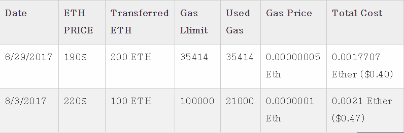

### What is the EVM ?

- EVM은 Ethereum을 전반적으로 관리하는 내부 시스템 중의 하나로 특정 위치에 종속되지 않고 시스템 상에 존재 한다.
- Smart contract을 네트워크에 적용하고, 실행 시키는 역할을 담당
- 단순히 vlaue만을 전송 할 경우 필요 없다.
- 이외의 모든 것은 EVM을 통해 진행되며 이 분산 컴퓨팅 시스템은 각각의 데이터 저장소도 갖는다.

- EVM 은 Stack기반 구조이다.
- 256bit 주소 크기기반으로 동작

### Comparison with Exsting Tech

- EVM 기존 VM(Virtualbox, KVM...)보다 제한적인 도메인에서 사용 된다.
- 큰 관점에서 봤을 때 EVM은O OS나 platform의 제한을 최소화하고 공통된 환경을 제공하는 것을 목표로 한다.
- 기존의 JVM이나 .NET F/W처럼 해당 Framework에서 작동 할 수 있게 해주는 bytecode를 추가하여 컴파일하게 되고, 실행시 해당 bytecode를 작동 시킨다.

- 특이한 점은 별도의 "Scheduler"가 내장되어 있지 않다.
  > 외부의 검증이 완료된 transaction을 기반으로 조작되기 때문에 필요없다.

### EVM Instruction Set (bytescode operations)

- 수학 연산과 로직 연산
- 실행된 컨텍스트 조회
- 스택, 메모리 및 스토리지 엑세스
- 흐름 조작 제어
- Logging, calling과 기타 동작

**해당 사항 외에도 EVM은 account, block 정보들에도 엑세스 할수 있다.**

- Arithmetic opcodes
  > ADD, MUL, SUB, DIV, SDIV, MOD, SMOD, ADDNOD, MULMOD, EXP, SIGNEXTEND, SHA3
- Stack opcodes
  > POP, MLOAD, MSTORE, MSTORE8, SLOAD, SSTORE, MSIZE, PUSHx, DUPx, SWAPx
- Process flwo opcodes
  > STOP, JUMP, JUMPI, PC, JUMPDEST
- System opcodes
  > LOGx, CREATE, CALL, CALLCODE, RETURN, DELEGATECALL, INVALIDE, SELFDESTURCT
- Logic operation
  > LT, GT, SLT, SGT, EQ, ISZERO, AND, OR, XOR, NOT, BYTE
- Env codes

  > _GAS, ADDRESS, BALANCE, ORIGIN, CALLER, CALLVALUE, CALLDATALOAD, ..._

#### Ethereum state

##### EVM은 Smart contract을 실행하고 실행된 유효한 결과를 이더리움에 반영하는 것이다.

- 이더리움상의 최상위 계층은 20bytes의 주소로 이루어진 계층이다.
- 하위 계층은 아래와 같이 구성되어 있다.

1. Account당 소유한 balance.
2. nonce값
3. account' storage (only contract)
4. progran code (only contract)

#### Compiling solidity to EVM bytecodes.

- Solidity compiler를 통해 컴파일이 가능함

* --opcodes 옵션을 통해 .sol파일의 opcode를 확인할 수 있다.

```solidity
pragma solidity ^0.4.19;

contract example {

  address contractOwner;

  function example() {
    contractOwner = msg.sender;
  }
}
```

**를 컴파일 해서 opcodes로 보게 되면 아래와 같다**

```
PUSH1 0x60 PUSH1 0x40 MSTORE CALLVALUE ISZERO PUSH1 0xE JUMPI PUSH1 0x0 DUP1
REVERT JUMPDEST CALLER PUSH1 0x0 DUP1 PUSH2 0x100 EXP DUP2 SLOAD DUP2 PUSH20
0xFFFFFFFFFFFFFFFFFFFFFFFFFFFFFFFFFFFFFFFF MUL NOT AND SWAP1 DUP4 PUSH20
0xFFFFFFFFFFFFFFFFFFFFFFFFFFFFFFFFFFFFFFFF AND MUL OR SWAP1 SSTORE POP PUSH1
0x35 DUP1 PUSH1 0x5B PUSH1 0x0 CODECOPY PUSH1 0x0 RETURN STOP PUSH1 0x60 PUSH1
0x40 MSTORE PUSH1 0x0 DUP1 REVERT STOP LOG1 PUSH6 0x627A7A723058 KECCAK256 JUMP
0xb9 SWAP14 0xcb 0x1e 0xdd RETURNDATACOPY 0xec 0xe0 0x1f 0x27 0xc9 PUSH5
0x9C5ABCC14A NUMBER 0x5e INVALID EXTCODESIZE 0xdb 0xcf EXTCODESIZE 0x27
EXTCODESIZE 0xe2 0xb8 SWAP10 0xed 0x
```

**를 --asm 옵션을 사용해서 어샘블리로 보면 아래와 같다**

```
/* "Example.sol":26:132  contract example {... */
  mstore(0x40, 0x60)
    /* "Example.sol":74:130  function example() {... */
  jumpi(tag_1, iszero(callvalue))
  0x0
  dup1
  revert
tag_1:
    /* "Example.sol":115:125  msg.sender */
  caller
    /* "Example.sol":99:112  contractOwner */
  0x0
  dup1
    /* "Example.sol":99:125  contractOwner = msg.sender */
  0x100
  exp
  dup2
  sload
  dup2
  0xffffffffffffffffffffffffffffffffffffffff
  mul
  not
  and
  swap1
  dup4
  0xffffffffffffffffffffffffffffffffffffffff
  and
  mul
  or
  swap1
  sstore
  pop
    /* "Example.sol":26:132  contract example {... */
  dataSize(sub_0)
  dup1
  dataOffset(sub_0)
  0x0
  codecopy
  0x0
  return
stop

sub_0: assembly {
        /* "Example.sol":26:132  contract example {... */
      mstore(0x40, 0x60)
      0x0
      dup1
      revert

    auxdata: 0xa165627a7a7230582056b99dcb1edd3eece01f27c9649c5abcc14a435efe3b...
}
```

**를 --bin-runtime 옵션을 사용하면 machine-readable한 Hexcode로 출력된다**

```
60606040523415600e57600080fd5b336000806101000a81548173
ffffffffffffffffffffffffffffffffffffffff
021916908373
ffffffffffffffffffffffffffffffffffffffff
160217905550603580605b6000396000f3006060604052600080fd00a165627a7a7230582056b...
```

위와 같이 여러 형태로 출력해서 볼 수 있지만,
우리는 opcode로 보는게 가장 편하다.

> i.g - PUSH1 0x60 PUSH1 0x40 MSTORE CALLVALUE

1. STACK에 0x60 1바이트를 넣는다
2. STACK에 0x40 1바이트를 넣는다
3. Memory store를 실행한다. == 0x40번지에 0x60이라는 값을 넣는다.
4. 해당 작업을 진행하는데 측정된 wei 값을 스택에 넣는다.

### Contract deployment code.

- 새로운 계약을 deploy하기 위해서는 0x0의 주소를 송신자로 갖는 특수 transaction을 발생시켜야 한다.

### Disassembling the Bytecode (Faucet.sol)

**Bytecode instructions**

```assembly
PUSH1 0x4
CALLDATASIZE
LT
PUSH1 0x3f
JUMPI
```

- Disassembling tool : Porositiy / Ethersplay / IDA-Evm

1. EVM에서 스마트 컨트렉을 실행하면 최초로 계약의 dispatcher가 실행된다.
   > Trasaction의 데이터 영역을 읽어 적절한 함수를 실행시킨다.
2. Dispatcher단계에서 함수의 유효성을 검증하기 위해 0x04와 실행될 함수의 keccak256 hash값의 앞 4바이트를 비교한다. (keccak256의 앞 4바이트는 함수 식별자로 사용된다.)
3. LT의 결과를 바탕으로 JUMPI 를 실행한다. (LT는 지금 stack의 데이터 필드 두개를 비교 하여 0,1로 리턴되는 함수)
   > Input으로 들어온 ABI데이터가 4bytes이하일 경우에는 fallback 함수로 분기되고, 이상일 경우에는 해당 함수로 분기되도록 구성되어 있다.
4. 예제의 경우 0x3f로 점프하도록 되어있는데 해당 flow를 따라가면 STOP instruction이 실행된다.

**이 처럼 opcode를 찾아서 따라가보면 디어셈블링이 가능하다**

> 이후 과정은 opcode를 따라가는 과정이기 때문에 생략 ...

### Turing completeness and Gas

이더리움 생태계는 싱글스레딩 방식으로 동작하므로 시스템적으로 무한 루프 작업에 취약하다.
실수나 악의적 공격에 의해 무한 루프를 돌게 되면 시스템이 Unusable 상태에 돌입 하게 되는데,
이를 방지하기 위해 **Gas**가 사용 된다.

#### Gas

gas는 어떠한 동작을 위해 이더리움 내부에 저장 자원과, 컴퓨팅 파워를 사용하는 양을 표현한다.

> from ethereum yellow paper.

- Adding two numbers costs 3 gas
- Calculating a Keccak-256 hash costs 30 gas + 6 gas for each 256 bits of data being hashed
- Sending a transaction costs 21,000 gas

#### 가스의 역할

1. 이더리움의 가격과 miner들이 받는 리워드

- Transaction을 발생시킨 자가 Gas를 충분히 가지고 있는지 파악 후 실제 블럭을 만든다.
- 부족할 경우 거래를 취소시킨다.
  > Out of gas exception

2. 서비스 거부 공격(DOS)공격 방어용

- 계속된 요청으로 gas값이 0이 될 경우 더 이상 trasaction을 발생 시킬 수 없기 때문에 유효방 방어 수단이 된다.

* Gas값은 이더리움의 현물 시세가에 따라 다르게 측정 된다. 대표적으로 아래 표와 같은 모습이다.
  
  > 일정 수준의 수수료 값을 유지하기 위해서 위와 같이 조절한다.

#### Gas cost VS Gas price

Gas cost : 작업을 수행 할 때 요구되는 가스 단위의 개수
Gas price : 네트워크로 전송 할 때 가스 단위당 지불할 의사가 있는 양

#### Nagative gas costs

특정 경우에 한하여 gas 값을 refund해준다

1. contract를 네트워크에서 지울 때 (SELFDESTRUCT) - 24,000 gas
2. data storage address를 0으로 설정할 때 - 15,000gas

#### Block gas limit

한 블럭에서 사용 할 수 있는 최대 가스의 양
https://etherscan.io를 보면 한 블럭당 기본 전송을 380개 정도 포함 할 수 있다.

> Transaction당 gas == 21,000 한 블럭의 gaslimit == 8,000,000
> Block gas limit은 miner들의 투표에 의해 결정된다(geth에 내장)
